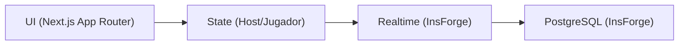
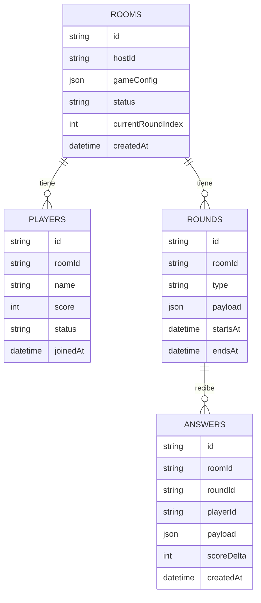

## 1. Diseño de Arquitectura

## 2. Descripción de Tecnologías
- Frontend: Next.js@14+ (App Router) + React@18 + TypeScript (estricto)
- Estilos: Tailwind CSS
- Animación: Framer Motion
- Realtime + DB: InsForge (PostgreSQL + Realtime)
- Hosting: pendiente (compatible con despliegue en plataformas comunes de Next.js)

## 3. Definición de Rutas (App Router)
| Ruta | Propósito |
|------|-----------|
| / | Crear sala (Host) o unirse con código (Jugador) |
| /room/[roomId] | Lobby de sala, lista de jugadores y control del Host |
| /room/[roomId]/play | Vista principal de juego (trivia/minijuego) |
| /room/[roomId]/results | Resultados por ronda y finales |

## 4. API (si aplica)
En primera fase, se prioriza realtime con InsForge. Si se requiere lógica adicional del Host en servidor, se evalúa:
- Route Handlers de Next.js para validaciones, generación de roomId y endpoints auxiliares.

## 5. Modelo de Datos (alto nivel)

## 6. Reglas Clave de Estado (Host vs Jugadores)
- Host: autoridad sobre transiciones (lobby → ronda → resultados → siguiente ronda).
- Jugadores: clientes reactivos que renderizan en base al estado realtime de la sala.
- Sincronización: el temporizador se deriva de timestamps del Host (no del reloj local del jugador).
