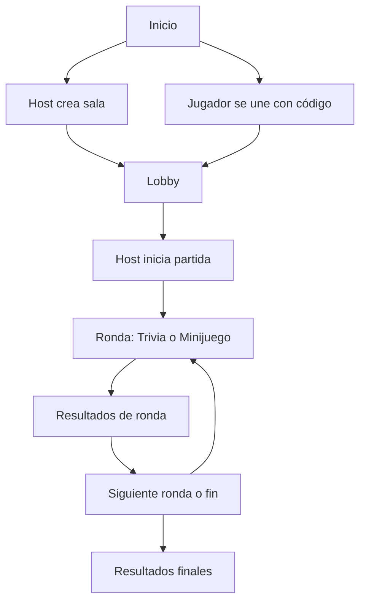

## 1. Visión General del Producto
Logos Match es un juego web mobile-first de trivia bíblica y minijuegos PvP en tiempo real.
Su objetivo es habilitar partidas rápidas con un Host que controla la lógica, mientras los jugadores responden desde clientes reactivos.

## 2. Funcionalidades Centrales

### 2.1 Roles de Usuario
| Rol | Método de ingreso | Permisos principales |
|-----|-------------------|----------------------|
| Host | Crear sala / código | Configurar partida, iniciar rondas, avanzar fases, cerrar partida |
| Jugador | Unirse con código | Responder preguntas, jugar minijuegos, ver resultados |

### 2.2 Módulos Funcionales
1. **Inicio**: CTA para crear sala o unirse con código, explicación breve, estado de conexión.
2. **Lobby**: lista de jugadores, estado listo, configuración visible, inicio por Host.
3. **Ronda (Trivia)**: pregunta + opciones grandes, temporizador, feedback inmediato, bloqueo al finalizar tiempo.
4. **Ronda (Minijuego PvP)**: interacción táctil, puntuación/estado, final por tiempo o condición de victoria.
5. **Resultados**: ranking, resumen por ronda, siguiente ronda o fin de partida.

### 2.3 Detalle de Páginas
| Página | Módulo | Descripción |
|--------|--------|-------------|
| / | Crear/Unirse | Crear sala (Host) o ingresar código (Jugador) |
| /room/[roomId] | Lobby | Gestión de jugadores y arranque por Host |
| /room/[roomId]/play | Ronda | Vista de juego (trivia/minijuego) según estado |
| /room/[roomId]/results | Resultados | Ranking y navegación entre rondas |

## 3. Proceso Principal
1. Host crea sala y obtiene un código/roomId.
2. Jugadores se unen con el código.
3. Host configura tiempos/reglas y arranca la partida.
4. Se ejecutan rondas alternando trivia/minijuegos.
5. Al final, se muestra ranking y se cierra la sala.

## 4. Diseño de Interfaz

### 4.1 Estilo
- Enfoque: mobile-first absoluto (táctil, botones grandes, márgenes generosos).
- Feedback: estados visuales inmediatos (selección, correcto/incorrecto, timeout).
- Tipografía: jerarquía clara (título, pregunta, opciones, meta).
- Movimiento: micro-interacciones con Framer Motion (entrada de preguntas, transiciones de ronda).

### 4.2 Resumen de Pantallas
| Página | Módulo | Elementos UI |
|--------|--------|--------------|
| / | Crear/Unirse | Input grande de código, botones primarios grandes, estado de conexión |
| /room/[roomId] | Lobby | tarjetas de jugadores, CTA Host, configuración legible |
| /room/[roomId]/play | Ronda | temporizador prominente, opciones en grid, feedback visual |
| /room/[roomId]/results | Resultados | ranking en lista, resumen por ronda, CTA continuar |

### 4.3 Responsividad
- Mobile-first táctil: targets > 44px, spacing consistente, evitar hover-dependence.
- Desktop: contenido centrado, límites de ancho, atajos opcionales sin romper móvil.
